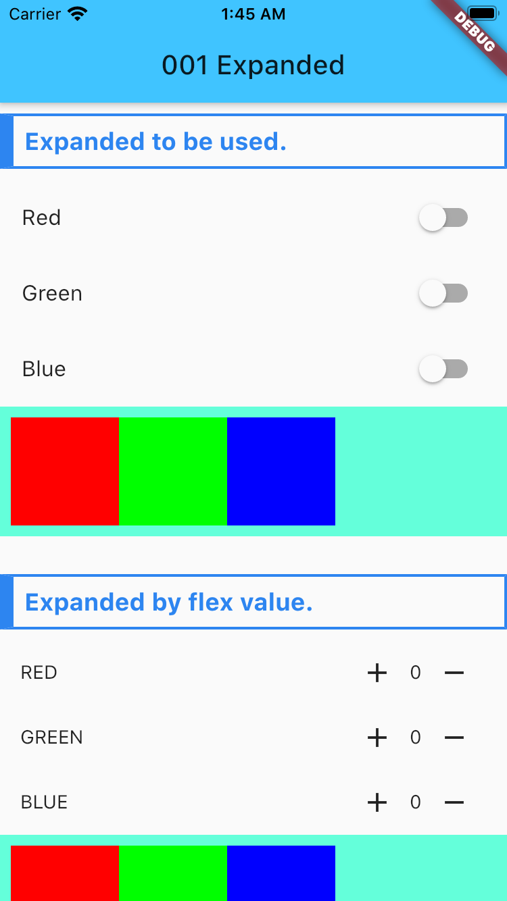

# f_001_widgets_expanded

A new Flutter application for widget 'Expanded'.

## Getting Started

Expanded 就是扩充的意思吧。

Demo中2展示了2种使用方式
1. 在一个Row中，仅仅包含Widget，那这个时候Widget是按照自己被定义的额宽度绘制的。如果某个加上，
那么他就会使用剩余的所有空间。

2. 通过设置flex的值，来分配Widget在容器中的占比宽度。